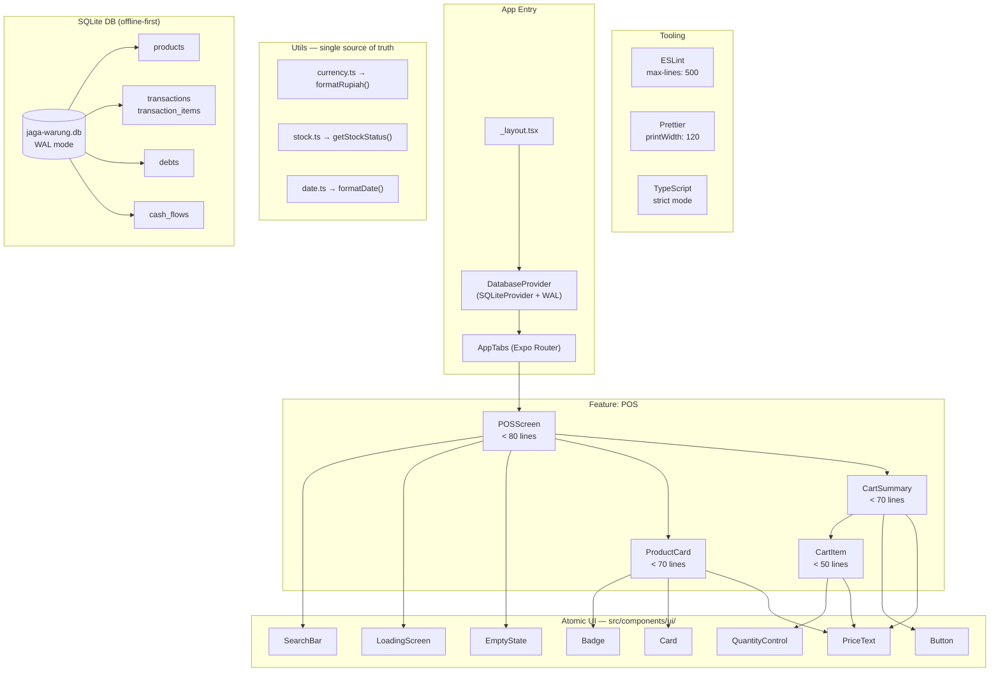

# Jaga Warung — POS & Grocery Store Management

## Objective

Build the foundation of a **Point of Sale (POS) & Grocery Store Management** application on top of the existing Expo codebase (`jaga-warung`). The implementation covers:
- Modular & scalable folder structure (feature-based)
- Offline-first SQLite database initialization with incremental migrations
- Zustand store for cashier shopping cart state
- UI components for the Cashier (POS) screen using NativeWind with a defined color palette
- **ESLint + Prettier** with an enforced `max-lines: 500` rule
- **Reusable component system** — atomic UI components used across features

All code patterns reference **Context7** for `expo-sqlite`, `zustand`, `nativewind`, and `react-hook-form/resolvers`.

---

## User Review Required

> [!IMPORTANT]
> **Additional dependencies need to be installed.** The following packages are not yet in `package.json`:
>
> **Runtime:**
> - `nativewind` (v4), `tailwindcss`
> - `zustand`, `immer`
> - `expo-sqlite`
> - `react-hook-form`, `@hookform/resolvers`, `zod`
> - `lucide-react-native`, `react-native-svg`
>
> **Dev (tooling):**
> - `eslint`, `eslint-config-expo`
> - `prettier`, `@trivago/prettier-plugin-sort-imports`, `prettier-plugin-tailwindcss`

> [!WARNING]
> **Expo SDK 57 + NativeWind v4:** Context7 confirms v4.1 is compatible with SDK 54. SDK 57 has not been officially tested. If compatibility issues arise, NativeWind v5 (beta) will be evaluated.

> [!NOTE]
> **Existing code will not be deleted.** Existing files (`animated-icon`, `app-tabs`, etc.) are left intact. We only add new directories and files.

---

## Final Decisions

| # | Question | Decision | Impact on Implementation |
|---|---|---|---|
| 1 | Multi-user? | ❌ Single-user only | No `users` table / auth flow needed |
| 2 | Print receipts? | ⚙️ Optional (toggle) | "Print" button available but not required; `react-native-thermal-printer` can be installed separately later |
| 3 | Dark mode? | ❌ Not needed | `userInterfaceStyle: "light"` in `app.json`; all NativeWind classes without `dark:` prefix |

> [!NOTE]
> The receipt printing feature is implemented with a **feature flag** in `useAppStore` (`isPrinterEnabled: false` by default). The print button only appears if the user enables it from Settings. No printer dependency is installed now.

---

## Engineering Guidelines (Added)

### File Size & Reusability Rules

| Rule | Detail |
|---|---|
| **Max 500 lines/file** | Enforced via ESLint `max-lines` rule (error if > 500) |
| **Atomic components** | Every UI element used in more than 1 place must become a component in `src/components/ui/` |
| **No inline logic** | Logic (formatting, computing) is separated into `utils/` or hooks |
| **Single responsibility** | 1 component = 1 primary responsibility |

### Reusable Component Tree

```
src/components/ui/          ← Atomic, knows nothing about business domain
├── Button.tsx              → Used: POS (Pay), Inventory (Save), Debt (Pay Debt)
├── Badge.tsx               → Used: StockBadge, DebtStatusBadge, CartCount
├── Card.tsx                → Used: ProductCard, DebtCard, CashFlowItem
├── EmptyState.tsx          → Used: all screens when data is empty
├── SearchBar.tsx           → Used: POSScreen, InventoryScreen
├── QuantityControl.tsx     → Used: CartItem, ProductCard (edit mode)
├── PriceText.tsx           → Used: ProductCard, CartSummary, DebtCard
└── LoadingScreen.tsx       → Used: all screens when loading

src/utils/
├── currency.ts             → formatRupiah() — used in all features
├── date.ts                 → formatDate(), formatRelative()
└── stock.ts                → getStockStatus() → 'ok' | 'low' | 'empty'
```

---

## Proposed Changes

### 1. Dependency Installation

See code examples in [`jaga-warung-pos-plan-code.md`](./jaga-warung-pos-plan-code.md#dependency-installation).

---

### 2. ESLint + Prettier Setup

> [!NOTE]
> **Plugin compatibility (Context7 verified):** `prettier-plugin-tailwindcss` has a built-in workaround for `@trivago/prettier-plugin-sort-imports`. The only requirement: **`prettier-plugin-tailwindcss` must always be in the last position** in the `plugins` array.

> [!IMPORTANT]
> **Plugin order must not be changed.** `prettier-plugin-tailwindcss` must be in the last position — an official TailwindLabs requirement so Tailwind class sorting runs after import sorting is complete.

> [!NOTE]
> **Import order rule is NOT added to ESLint** because `@trivago` already handles import sorting at the Prettier level. Having two tools for the same thing would conflict.

#### Tool Responsibility Split

| Feature | Tool |
|---|---|
| Sort & group imports (with line separators) | `@trivago/prettier-plugin-sort-imports` |
| Automatically sort Tailwind class order | `prettier-plugin-tailwindcss` |
| Max 500 lines/file (error if exceeded) | ESLint `max-lines` rule |
| Type safety | ESLint `@typescript-eslint` |

See full config examples in [`jaga-warung-pos-plan-code.md`](./jaga-warung-pos-plan-code.md#eslint-prettier-setup).

---

### 3. NativeWind v4 Configuration

See config file examples in [`jaga-warung-pos-plan-code.md`](./jaga-warung-pos-plan-code.md#nativewind-v4-configuration).

---

### 4. Project Folder Structure (Final)

```
jaga-warung/
├── src/
│   ├── app/
│   │   ├── _layout.tsx               # Root: DatabaseProvider wraps everything
│   │   ├── (tabs)/
│   │   │   ├── _layout.tsx           # Tab bar config
│   │   │   ├── index.tsx             # → POSScreen
│   │   │   ├── inventory.tsx         # → InventoryScreen
│   │   │   ├── debt.tsx              # → DebtScreen
│   │   │   └── cash-flow.tsx         # → CashFlowScreen
│   │   └── (modals)/
│   │       ├── add-product.tsx       # Modal: Add/Edit Product
│   │       ├── checkout.tsx          # Modal: Confirm Payment
│   │       └── add-debt.tsx          # Modal: Add Debt
│   │
│   ├── features/
│   │   ├── pos/
│   │   │   ├── components/
│   │   │   │   ├── ProductCard.tsx   # Uses: Card, Badge, PriceText, Button
│   │   │   │   ├── CartItem.tsx      # Uses: QuantityControl, PriceText
│   │   │   │   └── CartSummary.tsx   # Uses: CartItem, Button, PriceText
│   │   │   ├── hooks/
│   │   │   │   └── useProducts.ts
│   │   │   └── screens/
│   │   │       └── POSScreen.tsx     # Uses: SearchBar, LoadingScreen, EmptyState
│   │   │
│   │   ├── inventory/
│   │   │   ├── components/
│   │   │   │   └── ProductListItem.tsx  # Uses: Badge (stock), PriceText, Button
│   │   │   ├── hooks/
│   │   │   │   └── useInventory.ts
│   │   │   └── screens/
│   │   │       └── InventoryScreen.tsx  # Uses: SearchBar, LoadingScreen, EmptyState
│   │   │
│   │   ├── debt/
│   │   │   ├── components/
│   │   │   │   └── DebtCard.tsx      # Uses: Card, Badge (status), PriceText
│   │   │   ├── hooks/
│   │   │   │   └── useDebt.ts
│   │   │   └── screens/
│   │   │       └── DebtScreen.tsx    # Uses: LoadingScreen, EmptyState
│   │   │
│   │   └── cash-flow/
│   │       ├── components/
│   │       │   └── CashFlowItem.tsx  # Uses: Card, PriceText, Badge (type)
│   │       ├── hooks/
│   │       │   └── useCashFlow.ts
│   │       └── screens/
│   │           └── CashFlowScreen.tsx
│   │
│   ├── components/
│   │   ├── ui/                       # ← Atomic Reusable Components
│   │   │   ├── Button.tsx            # variant: primary|secondary|danger|ghost
│   │   │   ├── Badge.tsx             # variant: success|warning|danger|neutral
│   │   │   ├── Card.tsx              # wrapper with shadow & border
│   │   │   ├── EmptyState.tsx        # icon + title + subtitle
│   │   │   ├── SearchBar.tsx         # TextInput + Search icon
│   │   │   ├── QuantityControl.tsx   # Minus | qty | Plus
│   │   │   ├── PriceText.tsx         # Rupiah formatting + styling
│   │   │   └── LoadingScreen.tsx     # ActivityIndicator full-screen
│   │   └── layout/
│   │       └── ScreenContainer.tsx   # SafeAreaView + padding wrapper
│   │
│   ├── store/
│   │   ├── useCartStore.ts        # Cashier cart state
│   │   └── useAppStore.ts         # isPrinterEnabled, activeTab, etc.
│   │
│   ├── db/
│   │   ├── DatabaseProvider.tsx
│   │   ├── schema.ts
│   │   └── repositories/
│   │       ├── productRepository.ts
│   │       ├── transactionRepository.ts
│   │       ├── debtRepository.ts
│   │       └── cashFlowRepository.ts
│   │
│   ├── types/
│   │   ├── product.ts
│   │   ├── transaction.ts
│   │   ├── debt.ts
│   │   └── cash-flow.ts
│   │
│   ├── utils/
│   │   ├── currency.ts               # formatRupiah()
│   │   ├── date.ts                   # formatDate(), formatRelative()
│   │   └── stock.ts                  # getStockStatus()
│   │
│   ├── constants/
│   │   └── theme.ts                  # (existing + update color palette)
│   │
│   ├── hooks/
│   │   └── useDebounce.ts            # debounce for search input
│   │
│   └── global.css
│
├── eslint.config.js                  # [NEW]
├── .prettierrc                       # [NEW]
├── .prettierignore                   # [NEW]
├── tailwind.config.js                # [NEW]
├── metro.config.js                   # [NEW]
└── babel.config.js                   # [NEW/MODIFY]
```

---

### 5. Reusable UI Components

See full component implementations in [`jaga-warung-pos-plan-code.md`](./jaga-warung-pos-plan-code.md#reusable-ui-components).

---

### 6. SQLite Database — Types, Schema & Provider

See full type definitions and schema in [`jaga-warung-pos-plan-code.md`](./jaga-warung-pos-plan-code.md#database-sqlite).

---

### 7. Zustand Cart Store

See full store implementation in [`jaga-warung-pos-plan-code.md`](./jaga-warung-pos-plan-code.md#zustand-cart-store).

---

### 8. Feature Components (POS) — Using Reusable UI

See full component implementations in [`jaga-warung-pos-plan-code.md`](./jaga-warung-pos-plan-code.md#feature-components-pos).

---

### 9. Root Layout Update

See layout implementation in [`jaga-warung-pos-plan-code.md`](./jaga-warung-pos-plan-code.md#root-layout-update).

---

## Architecture Diagram



---

## Verification Plan

### Automated Tests

```bash
# 1. Install all dependencies
yarn install

# 2. TypeScript check
yarn typecheck

# 3. ESLint (includes max-lines check)
yarn lint

# 4. Prettier check
yarn format:check
```

### Manual Verification

| No | What to Verify | Expected |
|---|---|---|
| 1 | Build app without errors | `expo start` runs without crash |
| 2 | Database tables created | 5 tables appear in SQLite inspector |
| 3 | Cart store | Tap product → qty increases, total accurate |
| 4 | SearchBar | Type name → grid filters in real-time |
| 5 | Stock badge | `stock ≤ min_stock` → amber badge |
| 6 | EmptyState | Remove all products → empty state appears |
| 7 | ESLint max-lines | Create file > 500 lines → lint error |
| 8 | Button variants | Primary=emerald, Danger=red, Secondary=slate |
